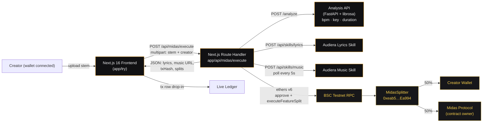
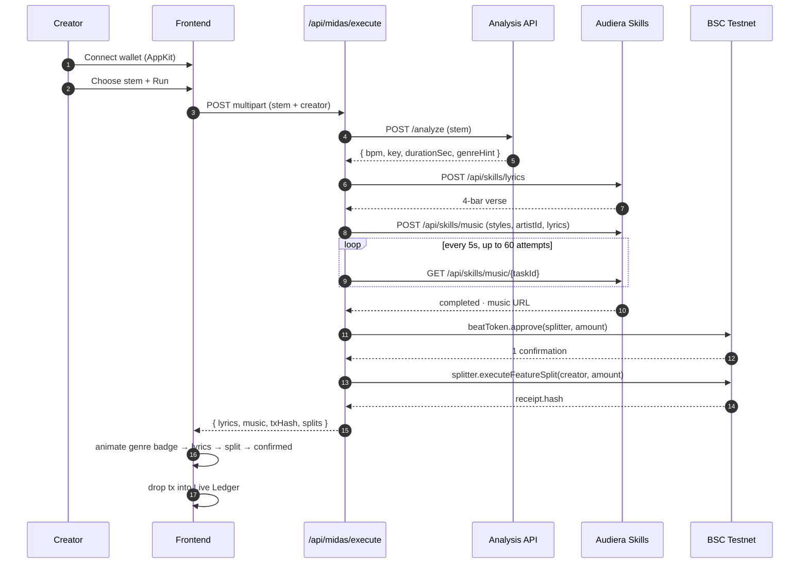
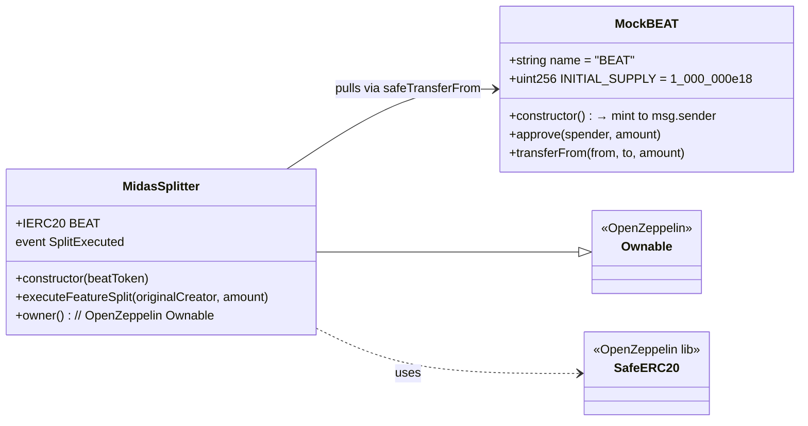

# Midas

> The autonomous feature agent that pays. Built for the Audiera Participation
> Economy on BNB Chain.

Midas is an AI agent that ingests a creator's stem, writes a feature verse
(powered by the **Audiera** lyrics + music skills), mints a full vocal track,
and settles a **50/50 revenue split on-chain** in a single flow. The creator
connects their wallet, uploads a stem, and watches their share of `$BEAT`
land on BSC Testnet — live.

---

## 🎬 Demo

> **60-second walkthrough of the full Create → Participate → Earn → Repeat loop.**
>
> Background music on the video is generated by Midas itself, via the
> Audiera Music Skill, during the same run being demonstrated. 🟡

**▶ Watch the demo:** [YOUR_VIDEO_URL_HERE](https://YOUR_VIDEO_URL_HERE)

| Timestamp | Beat | What's on screen |
|---|---|---|
| `0:00` | **Hook** | *"The Feature Agent That Pays."* — landing hero |
| `0:05` | **Persona · Skills · Wallet** | Three-pillar agent identity card |
| `0:15` | **The Loop** | Create → Participate → Earn → Repeat explainer |
| `0:25` | **Connect wallet** | Reown AppKit → MetaMask on BSC Testnet 97 |
| `0:32` | **Upload stem** | `.wav` file picker → stem queued |
| `0:33–0:48` | **Live synthesis** | Waveform pulse → Genre badge → Audiera lyrics fade in |
| `0:48–0:52` | **On-chain split** | Gold orb animates 50/50 between Creator ↔ Midas Protocol |
| `0:52–0:58` | **BscScan proof** | Real `MidasSplitter` tx on BNB Testnet opens in tab |
| `0:55` | **Ledger drop** | New row flashes gold at the top of the live ledger |
| `0:58` | **Close** | Hashtag wall — `#AudieraAI #BEAT #BinanceAI #AgentEconomy` |

> 🟣 Want to run it yourself? Follow [Setup — full stack](#setup--full-stack)
> and try the exact same flow at [`/try`](http://localhost:3000/try). Every
> tx hash in the demo is verifiable on
> [BscScan Testnet](https://testnet.bscscan.com/address/0xeab5F2f3308FC8c8a6f98119F7603451Dc6Ea994).

---

## Contents

- [Architecture](#architecture)
- [Pipeline flow](#pipeline-flow)
- [Repository layout](#repository-layout)
- [Setup — full stack](#setup--full-stack)
  - [1. Prerequisites](#1-prerequisites)
  - [2. Clone + dependencies](#2-clone--dependencies)
  - [3. Deploy the contracts](#3-deploy-the-contracts)
  - [4. Configure the frontend](#4-configure-the-frontend)
  - [5. (Optional) Run the analysis API](#5-optional-run-the-analysis-api)
  - [6. Launch](#6-launch)
- [Reference](#reference)
  - [Smart contracts](#smart-contracts)
  - [API — `POST /api/midas/execute`](#api--post-apimidasexecute)
  - [Analysis service — `POST /analyze`](#analysis-service--post-analyze)
  - [Environment variables](#environment-variables)
- [Deployed addresses (BSC Testnet)](#deployed-addresses-bsc-testnet)
- [Design system](#design-system)
- [Security notes](#security-notes)

---

## Architecture



**Four layers, one flow:**

1. **Frontend** (Next.js 16 + React 19 + Tailwind v4) — hero landing, `/try`
   Creator Studio, Proof ledger. Reown AppKit for WalletConnect/MetaMask.
2. **Agent API** (Next.js route handler) — orchestrates analysis → Audiera →
   on-chain settlement. Returns one JSON payload.
3. **Analysis sidecar** (FastAPI + `librosa`) — real BPM / key / duration from
   the uploaded stem. Optional — the route falls back to a deterministic seed
   if unreachable.
4. **Contracts** (Foundry + OpenZeppelin) — `MockBEAT` ERC-20 + `MidasSplitter`
   for the 50/50 revenue routing.

---

## Pipeline flow



---

## Repository layout

```
midas/
├── contracts/               # Foundry — on-chain layer
│   ├── src/
│   │   ├── MockBEAT.sol     # ERC-20, 1M initial supply to deployer
│   │   └── MidasSplitter.sol# 50/50 router (Ownable, SafeERC20)
│   ├── script/
│   │   └── DeployMidas.s.sol
│   ├── broadcast/           # Deployed addresses (committed)
│   ├── foundry.toml         # Solc 0.8.24 · OZ remapping
│   └── .env.example
│
├── frontend/                # Next.js 16 · React 19 · Tailwind v4
│   ├── app/
│   │   ├── page.tsx         # Landing: Hero · Engine · Proof
│   │   ├── try/page.tsx     # Live Creator Studio
│   │   └── api/midas/execute/route.ts  # The agent brain
│   ├── components/
│   │   ├── blocks/          # Hero, Engine, Proof, CreatorStudio
│   │   ├── layout/          # Navbar (wallet connect)
│   │   ├── midas/           # Agent state + wallet + upload/feed
│   │   └── ui/              # Atoms: GlowCard, CTAButton, TxFeed…
│   └── .env.example
│
├── analysis-api/            # FastAPI sidecar — real audio analysis
│   ├── app.py               # /analyze + /health
│   ├── Dockerfile
│   ├── ecosystem.config.cjs # PM2
│   └── requirements.txt
│
├── .cursor/skills/          # Audiera skill definitions (lyrics + music)
└── CLAUDE.md                # Design system spec (Obsidian + Gold)
```

---

## Setup — full stack

### 1. Prerequisites

| Tool | Version | Install |
|---|---|---|
| Node | ≥ 20 | `nvm install 20` |
| npm | ≥ 10 | ships with Node |
| Foundry | latest | `curl -L https://foundry.paradigm.xyz \| bash && foundryup` |
| MetaMask / any WalletConnect wallet | — | browser extension |
| Python | 3.11 (optional) | only needed for the analysis sidecar |
| tBNB | ~0.05 | [BNB Testnet Faucet](https://www.bnbchain.org/en/testnet-faucet) |

You'll also need accounts for:

- **Audiera** — `AUDIERA_API_KEY` (lyrics + music skills)
- **Reown** (formerly WalletConnect) — `NEXT_PUBLIC_REOWN_PROJECT_ID` from
  [cloud.reown.com](https://cloud.reown.com)

### 2. Clone + dependencies

```bash
git clone <your-fork-url> midas
cd midas

# Contracts — pull submodules + fetch forge-std
git submodule update --init --recursive
cd contracts
forge install foundry-rs/forge-std --no-commit
cd ..

# Frontend
cd frontend && npm install && cd ..
```

### 3. Deploy the contracts

```bash
cd contracts
cp .env.example .env
# edit .env → PRIVATE_KEY=0x…  (testnet-only, 0x prefixed, 66 chars total)

set -a; source .env; set +a

# Dry-run (simulates, no broadcast)
forge script script/DeployMidas.s.sol:DeployMidas \
  --rpc-url $BSC_TESTNET_RPC

# Real broadcast
forge script script/DeployMidas.s.sol:DeployMidas \
  --rpc-url $BSC_TESTNET_RPC \
  --broadcast
```

The script logs both addresses; Foundry also writes them to
`contracts/broadcast/DeployMidas.s.sol/97/run-latest.json`.

**After deploy**, transfer some `BEAT` from the deployer wallet to the
`MIDAS_AGENT_PRIVATE_KEY` wallet so the agent has tokens to split. The agent
needs tBNB for gas too.

### 4. Configure the frontend

```bash
cd frontend
cp .env.example .env
```

Fill in `frontend/.env`:

```env
AUDIERA_API_KEY=sk_audiera_...
AUDIERA_ARTIST_ID=i137z0bj0cwsbzrzd8m0c   # Jason Miller (default)

MIDAS_AGENT_PRIVATE_KEY=0x...              # broadcasts the split
NEXT_PUBLIC_BEAT_TOKEN_CONTRACT=0x3C4A79...efB901C4
NEXT_PUBLIC_SPLITTER_CONTRACT=0xeab5F2...Dc6Ea994
BSC_RPC_URL=https://data-seed-prebsc-1-s1.binance.org:8545

NEXT_PUBLIC_REOWN_PROJECT_ID=<from cloud.reown.com>

# Optional — only if you run the analysis sidecar
ANALYSIS_API_URL=http://localhost:8080/analyze
ANALYSIS_API_KEY=
```

### 5. (Optional) Run the analysis API

The frontend's agent route works without this — it'll use a deterministic
fallback for BPM/key/duration. Run the sidecar for **real** audio analysis.

```bash
cd analysis-api
python3 -m venv .venv && source .venv/bin/activate
pip install -r requirements.txt
uvicorn app:app --host 0.0.0.0 --port 8080
```

Or via Docker / PM2 — see [analysis-api/README.md](analysis-api/README.md).

### 6. Launch

```bash
cd frontend
npm run dev
```

Open [http://localhost:3000](http://localhost:3000):

1. Landing page explains the 4-step Engine.
2. Click **Try Now** → navigates to `/try`.
3. **Connect Wallet** (MetaMask on BSC Testnet chain `0x61`).
4. **Choose Stem** → `.wav` / `.mp3` from disk.
5. **Run Uploaded Stem** → watch:
   - Waveform pulse · *"Midas is analyzing your track…"*
   - Genre badge + lyrics fade in line-by-line on the right
   - Gold orb splits 50/50 between **Your Wallet** and **Midas Protocol**
   - **Settlement Confirmed** with a live BscScan link
   - Ledger at the bottom drops a new row with the real tx hash

---

## Reference

### Smart contracts



**Pull pattern** — the caller of `executeFeatureSplit` must have first
`approve`d the splitter to spend `amount` BEAT. The frontend agent does both
within the same request:

```solidity
function executeFeatureSplit(address originalCreator, uint256 amount) external {
    uint256 creatorAmount = amount / 2;
    uint256 ownerAmount   = amount - creatorAmount;   // odd wei → owner
    BEAT.safeTransferFrom(msg.sender, originalCreator, creatorAmount);
    BEAT.safeTransferFrom(msg.sender, owner(),         ownerAmount);
    emit SplitExecuted(originalCreator, owner(), creatorAmount, ownerAmount, amount);
}
```

### API — `POST /api/midas/execute`

Accepts either JSON (`{ creator }`) or `multipart/form-data` (`creator` +
`stem` file field). Response shape:

```jsonc
{
  "status": "success",
  "genre": "Dark Drill",

  "metadata": {
    "bpm": 142,              // from analysis API when available
    "key": "F# minor",
    "durationSec": 187,
    "analysisSource": "vps", // or "fallback"
    "sourceFileName": "demo.wav",
    "cid": "bafybe…"         // mock IPFS CID
  },

  "audiera_lyrics_status": "success",
  "lyrics": "…4 lines…",

  "audiera_music_status": "completed",   // or "processing" | "error"
  "audiera_music_job_id": "tsk_…",
  "audiera_music_url":    "https://ai.audiera.fi/music/12345",
  "audiera_music_file_url":"https://cdn.audiera.fi/…",
  "audiera_music_title":  "…",
  "audiera_music_duration": 180,
  "audiera_artist_id": "i137z0bj0cwsbzrzd8m0c",
  "audiera_artist_name": "Jason Miller",

  "txHash": "0x…real BSC hash…",
  "bscScanUrl": "https://testnet.bscscan.com/tx/0x…",
  "onChain": { "status": "broadcast", "error": null },

  "amount": "3421.0",
  "amountRaw": "3421000000000000000000",
  "splits": {
    "originalCreator": "0x…",     // connected wallet or random
    "creatorAmount":   "1710.5",
    "ownerAmount":     "1710.5"
  },

  "contracts": {
    "beatToken": "0x3C4A…01C4",
    "splitter":  "0xeab5…Ea994",
    "rpc":       "https://data-seed-prebsc-1-s1.binance.org:8545"
  }
}
```

Every step is try/catch'd — if the analysis VPS is down, fallback metadata is
used; if on-chain settlement fails, `txHash` falls back to a random `0x…` and
`onChain.error` carries the message. The pipeline never crashes mid-flight.

### Analysis service — `POST /analyze`

`multipart/form-data` with field `stem` (`.wav` / `.mp3`). Optional
`Authorization: Bearer <ANALYSIS_API_KEY>` when the service was started with
that env var.

```json
{
  "bpm": 122,
  "key": "A minor",
  "durationSec": 184,
  "genreHint": "Dark Drill"
}
```

Uses `librosa.beat.beat_track` for BPM and a Krumhansl chroma-profile match
against all 24 major/minor keys. See [analysis-api/app.py](analysis-api/app.py).

### Environment variables

| Variable | Where | Required | Purpose |
|---|---|---|---|
| `PRIVATE_KEY` | `contracts/.env` | ✅ for deploy | Deployer wallet (needs tBNB) |
| `BSC_TESTNET_RPC` | `contracts/.env` | ✅ for deploy | Foundry `--rpc-url` |
| `BSCSCAN_API_KEY` | `contracts/.env` | optional | `--verify` after deploy |
| `AUDIERA_API_KEY` | `frontend/.env` | ✅ | Lyrics + music skills bearer token |
| `AUDIERA_ARTIST_ID` | `frontend/.env` | optional | Default feature artist (else derived from wallet hex) |
| `MIDAS_AGENT_PRIVATE_KEY` | `frontend/.env` | ✅ | Agent that pulls + splits BEAT |
| `NEXT_PUBLIC_BEAT_TOKEN_CONTRACT` | `frontend/.env` | ✅ | Deployed MockBEAT |
| `NEXT_PUBLIC_SPLITTER_CONTRACT` | `frontend/.env` | ✅ | Deployed MidasSplitter |
| `BSC_RPC_URL` | `frontend/.env` | ✅ | Ethers provider URL |
| `NEXT_PUBLIC_REOWN_PROJECT_ID` | `frontend/.env` | ✅ | WalletConnect / AppKit project id |
| `ANALYSIS_API_URL` | `frontend/.env` | optional | Sidecar endpoint |
| `ANALYSIS_API_KEY` | `frontend/.env` & `analysis-api` | optional | Bearer auth between them |

---

## Deployed addresses (BSC Testnet · chain `0x61` / `97`)

| Contract | Address | Explorer |
|---|---|---|
| **MockBEAT** | `0x3C4A79c3C45bcB31b892403181BFB558efB901C4` | [BscScan](https://testnet.bscscan.com/address/0x3C4A79c3C45bcB31b892403181BFB558efB901C4) |
| **MidasSplitter** | `0xeab5F2f3308FC8c8a6f98119F7603451Dc6Ea994` | [BscScan](https://testnet.bscscan.com/address/0xeab5F2f3308FC8c8a6f98119F7603451Dc6Ea994) |

Deploy receipts live in [contracts/broadcast/DeployMidas.s.sol/97/run-latest.json](contracts/broadcast/DeployMidas.s.sol/97/run-latest.json).

---

## Design system

Defined in [CLAUDE.md](CLAUDE.md). TL;DR:

- **Canvas** — Obsidian `#0A0A0A`, elevated `#111113`, raised `#17171A`.
- **Accent** — Amber-500 `#F59E0B` primary, Amber-300 `#FCD34D` hover, metallic
  gold `#D4AF37` reserved for revenue/high-value data.
- **Borders** — 1px. `white/10` default → `white/20` hover → `amber-500/50` active.
- **Type** — Space Grotesk / Geist display, Geist Sans body, **Geist Mono**
  for every wallet, hash, amount, and JSON key.
- **Motion** — Framer Motion (`motion/react`) with spring physics
  (`stiffness 400 / damping 30`). No CSS `ease-in-out` for interactive states.
- **Grid** — 8-point spacing. No arbitrary pixel values.
- **Geometry** — `rounded-full` for pills/CTAs, `rounded-2xl` max for cards,
  `rounded-none` for terminals/code.

---

## Security notes

- **Never** commit a real `.env`. Both `contracts/.gitignore` and
  `frontend/.gitignore` already cover `.env*`.
- The `MIDAS_AGENT_PRIVATE_KEY` lives in `frontend/.env` because the route
  handler is a **server** component — it never reaches the browser. Do **not**
  prefix it with `NEXT_PUBLIC_`.
- Use a dedicated **testnet-only** wallet for the agent. Rotate immediately if
  the key leaks into a logs, chat, or commit.
- `MidasSplitter` uses `SafeERC20` + checks `amount > 0` and non-zero
  addresses. Odd-wei remainder goes to the owner side so totals reconcile.
- The analysis API writes uploaded stems to `/tmp` and deletes them in the
  `finally` block — no persistence.

---

## License

MIT — do whatever, just credit Midas in the Audiera Participation Economy.
